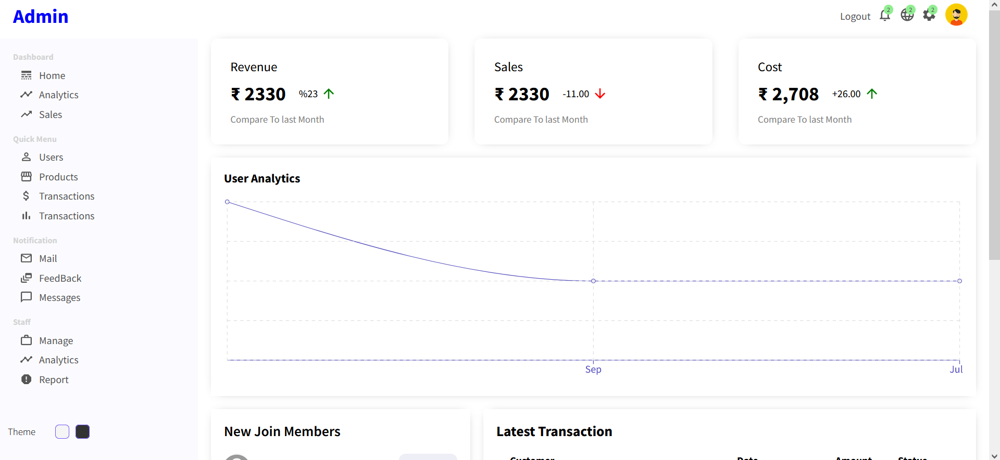

# Project Description
A simple e-Commerce app with features like searching, filtering data,add to cart, order product with stripe API. a great project to learn about the Mongodb CRUD operation and some advanced queries like aggregation,`$project`,`$match`,`$eleMatch` ,`$group `etc. there is also a admin web app from where you can create,update,delete,edit the **users'**,**orders'** and **product's** data. here is the [Demo](https://www.instagram.com/reel/Cjh4qjVDPOr/)

**React Web App**

<br/>

**Admin Web App**


# Project Setup
1. Create .env file at server's roots folder and define below mentioned variables
```js
MONGO_URL=you mongodb url
PORT=5000

PASS_SEC=passwordsecret
JWT_SEC_KEY=jwtsecretkey
STRIPE_KEY=strip_test_key

CLIENT_URL=http://localhost:3000
SERVER_URL=http://localhost:5000/api

```
2. create and login into stripe [account](https://stripe.com/docs/development/dashboard/manage-api-keys) and paste the `Secret key` in the .env file.
3. before you run the app create some data according to schema designed in [models](server/models).
4. you can also directly import the json file into postman for api overview from [here](assets/postman/Ecommerce%20Backend%20API.postman_collection.json)
5. don't forget to setup your mongodb database to communicate with your local computer in the network access tab.
6. Database name is `shop` which can also be mentioned in mongodb URL as `....mongodb.net/shop?retryWrites=true&w=majority`
   1. collection names
        1. [orders](assets/mongodb/orders.json)
        2. [products](assets/mongodb/products.json)
        3. [users](assets/mongodb/users.json)
   